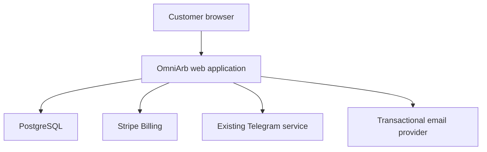
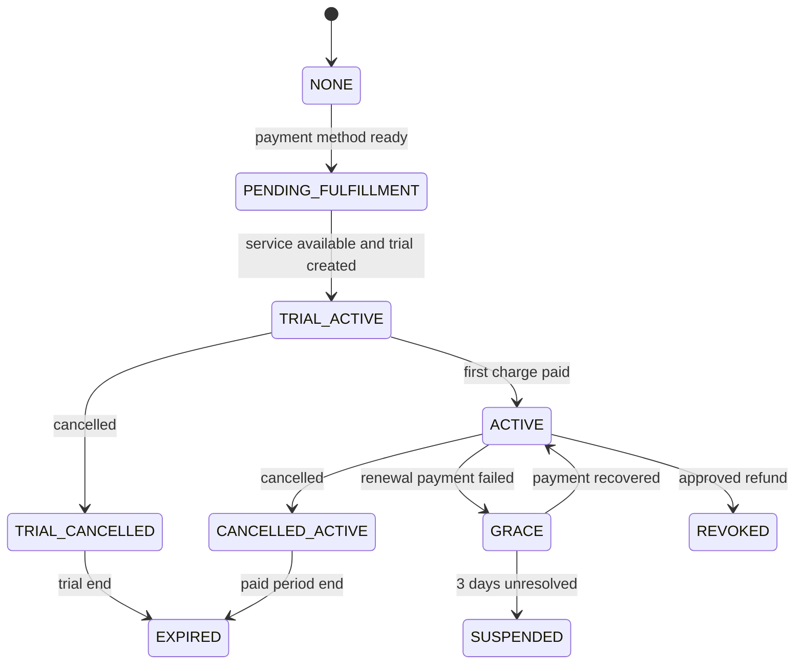

# OmniArb — Architecture Baseline

**Owner:** Software Architect

**Status:** Approved architecture baseline

**Date:** 2026-09-02

**Scope:** Italian MVP, Italy-only B2C launch

---

## 1. Purpose and source of truth

This document translates the approved product requirements in
`docs/product-requirements.md` and the feature specifications in `specs/` into
an implementable technical design.

Detailed implementation contracts are maintained in:

- `docs/data-model.md` for relational entities, constraints and transactions;
- `docs/api.md` for HTTP, provider callback and adapter contracts;
- `docs/security.md` for the threat model and required controls.

Product rules remain owned by the Project Manager/Product Owner. If this
document conflicts with an approved product requirement, the product
requirement wins and the conflict must be returned to the PM and Architect.

The web application owns the public website, the commercial funnel, billing
integration, entitlement, Telegram identity linking and customer onboarding.
It does not own or reimplement the arbitrage engine, place bets, hold customer
funds or become an alerts dashboard.

---

## 2. Architectural drivers

The architecture must satisfy these non-negotiable constraints:

- the informational website can be released before commerce is enabled;
- commercial endpoints are disabled by default until every launch gate passes;
- a customer receives seven actual days of usable Telegram service;
- checkout redirects and browser input never establish entitlement;
- verified Stripe events are authoritative for billing state;
- OmniArb is authoritative for service entitlement;
- Telegram fulfillment is tracked separately from billing;
- one subscription authorizes one Telegram numeric identity at a time;
- the existing Telegram service remains an external dependency;
- payment card data is handled by Stripe;
- the MVP has no OmniArb password account or customer dashboard;
- only necessary customer and integration data is retained;
- integration operations tolerate retries without duplicating access or side
  effects.

---

## 3. System shape

OmniArb is a **modular monolith**. One deployable web application contains the
public UI, server routes and domain modules, backed by one PostgreSQL database.
External services are accessed through narrow adapters.



A microservice split is not justified for the MVP. The traffic profile,
workflow volume and team size favor simpler deployment, transactions and
observability. The module boundaries below allow later extraction if evidence
shows that it is needed.

---

## 4. Technology baseline

| Area | Decision |
|---|---|
| Application | Next.js with TypeScript |
| Rendering | Server/static rendering by default; client components only where interaction requires them |
| Persistence | Managed PostgreSQL |
| Data access and migrations | Prisma |
| Payments | Stripe Checkout/Setup, Subscription Billing and Customer Portal |
| Hosting | Vercel-compatible deployment with managed PostgreSQL |
| Unit/integration tests | Vitest |
| Browser/end-to-end tests | Playwright |
| Styling | Project-local CSS approach selected by the Developer; no global state library is required |
| Email | Provider-neutral `EmailService` adapter |
| Analytics | Provider-neutral, privacy-focused event adapter |

No exact dependency version is mandated here. The Developer must pin supported
versions, commit lockfiles and validate framework/provider compatibility during
project scaffolding.

---

## 5. Code boundaries

The intended source layout is conceptual; the Developer may adapt names while
preserving responsibilities.

```text
src/
├── app/
│   ├── (marketing)/
│   ├── onboarding/
│   └── api/
├── components/
├── content/
├── modules/
│   ├── customers/
│   ├── billing/
│   ├── entitlements/
│   ├── telegram/
│   ├── email/
│   └── analytics/
└── lib/
    ├── config/
    ├── db/
    └── integrations/
```

### Module responsibilities

| Module | Owns | Must not own |
|---|---|---|
| Marketing | Italian public content, pricing presentation, legal/risk links, pre-launch CTA | Entitlement decisions |
| Customers | Normalized email identity and association with one Telegram user ID | Password authentication |
| Billing | Stripe customers, payment-method setup, subscriptions, webhooks and portal sessions | Telegram access state |
| Entitlements | Access state and lifecycle derived from trusted billing and fulfillment facts | Raw Stripe object handling |
| Telegram | Identity handshake, provisioning/revocation adapter and fulfillment attempts | Arbitrage detection |
| Email | Retry-safe transactional messages | General marketing campaigns |
| Analytics | Anonymous/minimized funnel events | Billing or Telegram identifiers in event payloads |

Domain logic must not import Stripe or Telegram SDK types outside the relevant
adapter/module boundary.

---

## 6. Commercial launch gate

The application has a server-side deployment mode:

```text
PRE_LAUNCH
COMMERCIAL
```

`PRE_LAUNCH` is the safe default. In that mode:

- pricing and trial terms may be shown;
- the primary CTA reads `Prossimamente`;
- checkout/payment-method collection is rejected server-side;
- subscription and portal creation are rejected server-side;
- Telegram commercial provisioning is not triggered;
- a hidden link, crafted request or stale browser bundle cannot bypass the
  restriction.

Changing the deployment setting to `COMMERCIAL` is necessary but not sufficient
for launch. The human approval and M6 gates in `docs/roadmap.md` must first be
recorded as complete. Secrets and provider configuration must also be validated
at startup/deployment time.

---

## 7. Customer and Telegram identity

OmniArb has no local password account. The durable relationship is anchored by:

- normalized customer email for commercial/contact identity;
- immutable Telegram numeric user ID for service identity;
- Stripe customer ID for provider correlation.

Self-service billing uses verified-email magic links rather than a password
account. A rate-limited request endpoint always returns a neutral response; if
the email belongs to a customer, OmniArb emails a short-lived, single-use link.
Redeeming that link server-side creates a Stripe Customer Portal session for
the already-associated Stripe customer. Supplying an email address alone never
returns a portal URL or reveals whether a customer exists.

Telegram usernames are display metadata only because they can change or be
absent. Numeric Telegram IDs are stored losslessly as strings or 64-bit values.

### Linking flow

1. The server creates a cryptographically random, short-lived, single-use link
   token and stores only its hash.
2. The browser opens `https://t.me/<bot>?start=<token>`.
3. The existing bot receives the token together with the authenticated Telegram
   numeric user ID.
4. The bot calls an authenticated server-to-server callback, or an equivalent
   trusted adapter operation, with the token and numeric ID.
5. OmniArb atomically consumes the token and associates the Telegram identity.
6. Replayed, expired or already consumed tokens are rejected.

The link token proves possession of a pending flow; it is not itself an
entitlement credential. The bot callback additionally requires service
authentication.

For delivery through a private Telegram channel or supergroup, the preferred
access artifact is a short-lived join-request invite created by the bot. The
bot approves only the already-linked numeric Telegram user ID, revokes the
invite after use and confirms membership before service availability is
recorded. If the existing service delivers alerts directly through the bot, an
entitlement allowlist keyed by numeric user ID is preferable and no chat invite
is required. See ADR-008; the choice remains blocked on PRE-003 capability
verification.

One-trial enforcement uses the normalized email and verified Telegram numeric
ID as independent denial signals. A consumed trial associated with either
identity prevents automatic issuance of another trial. False-positive disputes
or legitimate identity changes require an audited support decision; the system
must not silently create a second trial.

---

## 8. Billing, fulfillment and trial activation

### 8.1 Separation of authority

Three related states are deliberately separate:

| State | Authority | Examples |
|---|---|---|
| Billing | Stripe, observed through verified webhooks/API reconciliation | payment method ready, trialing, active, past due, cancelled, refunded |
| Fulfillment | Telegram adapter and recorded attempts | pending, provisioned, failed, revoked |
| Entitlement | OmniArb domain rules | trial active, paid active, grace, suspended, expired, revoked |

A Stripe subscription status does not by itself prove that Telegram service is
available. A Telegram invite/provisioning response does not by itself prove
commercial entitlement.

### 8.2 Seven-actual-day trial flow

The application must not start the final Stripe trial before Telegram service
is available. The recommended orchestration is:

1. collect and verify email and Telegram identity;
2. verify commercial mode and one-trial eligibility;
3. use a Stripe-hosted setup flow to collect a payment method without charging
   €50 or starting the subscription trial;
4. confirm completion from verified Stripe events;
5. create a durable fulfillment attempt and idempotently provision Telegram
   access;
6. on successful service availability, record `serviceAvailableAt`;
7. create the Stripe subscription with trial end equal to
   `serviceAvailableAt + 7 days`;
8. mark the trial grant consumed and entitlement `TRIAL_ACTIVE` only after the
   required provider identifiers and timestamps are durably recorded;
9. show and email the onboarding information;
10. schedule the first-charge reminder for approximately 24–48 hours before
    the trial end.

If Telegram provisioning fails, the saved payment method may exist, but no
subscription trial starts, no €50 payment occurs and no active entitlement is
claimed. The attempt remains recoverable through retry/manual fallback.

If subscription creation fails after Telegram provisioning, the orchestration
must retry safely and, if recovery is not possible, revoke the provisional
access or route the case to manual operations. It must not leave untracked
access active.

### 8.3 Entitlement lifecycle



All transitions are domain commands triggered by trusted facts, not direct
assignment from the browser. Cancellation preserves access until the applicable
trial/paid end. An approved voluntary refund revokes entitlement. Failed renewal
preserves access through the three-day grace period, then suspends it if still
unresolved.

---

## 9. Persistence model

The following entities are the minimum conceptual model. Exact table/column
names belong to implementation.

The normalized relational model, invariants and transaction boundaries are
defined in `docs/data-model.md`.

| Entity | Required information |
|---|---|
| `Customer` | internal ID, normalized email, Telegram numeric ID, Stripe customer ID, timestamps |
| `TrialGrant` | customer/identity keys, consumed timestamp, source, support override audit data if applicable |
| `BillingSubscription` | customer, Stripe subscription ID, provider status, trial/period boundaries, cancellation and first-payment timestamps |
| `Entitlement` | customer, status, `serviceAvailableAt`, `validUntil`, `graceUntil`, revocation/suspension timestamps |
| `TelegramLink` | token hash, expiry, consumption timestamp, linked Telegram ID |
| `FulfillmentAttempt` | customer, idempotency key, operation, status, attempts, failure category and timestamps |
| `IntegrationEvent` | provider, external event ID, type, processing status and timestamps |
| `OutboxEvent` | domain event, deduplication key, payload version, delivery attempts and status |
| `EmailDelivery` | message type, customer, deduplication key, provider reference and status |

Database constraints must enforce uniqueness for Stripe event IDs, Stripe
subscription/customer IDs, active identity associations and operation
idempotency keys where applicable.

Do not store card details, bookmaker credentials, betting-account data,
customer bankroll data or raw sensitive provider payloads without a demonstrated
need.

---

## 10. Integration contracts

Route names may change, but the following trust boundaries are required.

Concrete request, response, authentication and error contracts are defined in
`docs/api.md`.

### Customer-facing server routes

| Logical operation | Contract |
|---|---|
| Create Telegram link | Validates input/rate limit, creates single-use link attempt, returns bot deep link |
| Create payment-method setup session | Requires `COMMERCIAL`, verified Telegram link and eligibility; returns Stripe-hosted session URL |
| Request billing-management link | Accepts an email, returns a neutral response and sends a magic link only for a known eligible customer |
| Redeem billing-management link | Atomically consumes the link, resolves the Stripe customer server-side and redirects to a short-lived portal session |
| Read onboarding status | Returns only the caller's opaque flow status; never accepts entitlement claims |

Because the MVP has no account, customer-facing continuation links must use
short-lived, scoped, single-use or rotatable opaque credentials. They must not
expose sequential customer IDs.

### Provider/server routes

| Logical operation | Contract |
|---|---|
| Stripe webhook | Verifies raw-body signature, deduplicates event ID, persists state transactionally and schedules retry-safe side effects |
| Telegram link callback | Requires service authentication, consumes link token once and records numeric Telegram ID |
| Scheduled reconciliation | Rechecks incomplete provider workflows and repairs missed/delayed events without granting duplicate access |
| Scheduled lifecycle processing | Handles reminders, grace expiry, entitlement expiry and pending outbox work idempotently |

### Internal adapter interfaces

```ts
interface TelegramProvisioningService {
  provisionAccess(input: {
    customerId: string;
    telegramUserId: string;
    idempotencyKey: string;
  }): Promise<{ status: "provisioned" | "already_provisioned" }>;

  revokeAccess(input: {
    customerId: string;
    telegramUserId: string;
    idempotencyKey: string;
  }): Promise<{ status: "revoked" | "already_revoked" }>;
}

interface EmailService {
  sendTransactional(input: {
    template: string;
    recipient: string;
    data: Record<string, unknown>;
    idempotencyKey: string;
  }): Promise<{ providerMessageId: string }>;
}
```

Provider calls must have bounded timeouts, categorized errors and safe retries.

---

## 11. Reliable event processing

Stripe retries webhooks and network failures can leave any multi-provider flow
partially complete. Processing therefore follows this pattern:

1. verify provider authenticity;
2. reject malformed input;
3. deduplicate using the external event ID;
4. update domain state and write required outbox events in one database
   transaction;
5. acknowledge the provider promptly;
6. perform external side effects from retryable outbox/fulfillment work;
7. reconcile incomplete operations on a schedule.

No general-purpose message broker is required initially. A database outbox plus
scheduled/triggered worker is sufficient at MVP scale. The design can move to a
queue later without changing domain contracts.

---

## 12. Email and analytics

Transactional email events include:

- trial/service activation and onboarding;
- first-charge reminder;
- payment failure and update-payment action;
- grace expiry/suspension;
- cancellation confirmation where required;
- manual-onboarding fallback communication.

Each send uses a durable deduplication key and records delivery status. Provider
selection is configuration, not a domain dependency.

Analytics is restricted to a small allowlist such as `landing_view`,
`pricing_view`, `trial_cta_clicked`, `trial_started` and
`onboarding_completed`. Events must not contain email, Telegram ID, Stripe ID or
other direct identifiers. Consent and retention follow the approved privacy
design; analytics remains disabled where that design is not ready.

---

## 13. Security and privacy controls

- secrets are server-only and supplied through deployment secret management;
- Stripe webhook signatures are verified against the unmodified request body;
- Telegram service callbacks use authenticated, rotatable credentials;
- all commercial input is schema-validated and size-limited;
- linking, status and checkout endpoints are rate-limited;
- opaque tokens are random, scoped, short-lived, single-use and stored hashed
  where feasible;
- authorization and entitlement checks occur server-side;
- database access is not exposed to browser code;
- logs use structured fields and exclude secrets, card data, raw tokens and
  unnecessary personal data;
- audit records cover support overrides, refunds and identity changes;
- dependency, secret and production configuration checks are part of CI/release
  readiness;
- backups, retention and deletion procedures must be defined before commercial
  launch.

The control-to-threat mapping and security acceptance tests are maintained in
`docs/security.md`.

The exact Italy-only and age-verification controls remain blocked on legal/PM
decisions and must not be invented by implementation.

---

## 14. Deployment and operations

Environments are separated at minimum into local/development, preview/test and
production. Each uses isolated databases, Stripe configuration, webhook secrets
and Telegram/email credentials. Test events and production events must never
share durable state.

Deployments require:

- repeatable database migrations;
- validation of required environment variables;
- health checks for application/database connectivity;
- structured logs with correlation IDs;
- error monitoring and alerts for webhook, fulfillment, reconciliation and
  email failures;
- a documented rollback/recovery procedure;
- manual operational runbooks for Telegram fallback, refunds and identity
  changes before commercial launch.

Database migrations run as an explicit deployment step and must remain backward
compatible with the currently deployed application during rollout where
possible.

---

## 15. Testing strategy

| Layer | Required coverage |
|---|---|
| Unit | entitlement transitions, eligibility, trial consumption, cancellation, refund and grace calculations |
| Integration | database constraints/transactions, Stripe event handling, outbox processing, Telegram and email adapters |
| Contract | representative Stripe fixtures and the external Telegram provisioning contract |
| End-to-end | informational landing, pre-launch gate, identity linking, payment setup, trial activation, portal cancellation and failure recovery |
| Security | forged redirects, invalid webhook signatures, replayed events/tokens, rate limits, client-side entitlement manipulation |
| Accessibility/responsive | keyboard/focus, semantic structure, image alternatives, reduced motion, mobile and desktop viewports |

Critical cases include duplicate Stripe events, duplicate Telegram provisioning,
expired/replayed link tokens, Telegram unavailable after payment-method setup,
subscription creation failure after provisioning, delayed/missing webhooks,
second-trial attempts, cancellation during trial, failed renewal recovery,
grace expiry and approved refund revocation.

CI must run formatting/linting, type checking, unit/integration tests and the
appropriate browser smoke tests before review. Commercial E2E tests use Stripe
test mode and a controlled Telegram adapter/test environment.

---

## 16. External prerequisites and unresolved blockers

These do not block OMNI-002 informational implementation, but they block the
commercial flow:

- verify that the existing Telegram service can link, provision and revoke a
  numeric Telegram user ID idempotently;
- define the authenticated callback/integration mechanism with that service;
- define seller legal identity and support email;
- obtain reviewed Italian legal/privacy/customer content;
- finalize Italy-only eligibility and age/compliance requirements;
- select/configure transactional email and privacy-approved analytics providers;
- document and test manual Telegram fulfillment fallback.

If the Telegram service cannot meet the provisioning contract, the missing
capability is a separately scoped external prerequisite. It does not move the
arbitrage engine into the website project.

---

## 17. Developer handoff — first increment

The first implementation increment is **OMNI-002 in `PRE_LAUNCH` mode**.

### Required components

- Next.js/TypeScript application shell;
- Italian marketing and educational landing page;
- static illustrative arbitrage example;
- Telegram explanation and approved screenshot/mockup slots;
- pricing/trial, FAQ, risk and eligibility sections;
- footer/legal placeholders that do not invent seller data;
- server-side commercial-mode configuration;
- responsive and accessible behavior;
- privacy-safe analytics adapter, disabled until configuration/consent is ready.

### Constraints

- no reachable checkout, payment collection or Telegram provisioning;
- CTA is `Prossimamente`;
- no English localization, account/dashboard, interactive calculator, waiting
  list, testimonials, guaranteed returns or guaranteed alert frequency;
- no fabricated seller/legal details or product evidence;
- no implementation of the arbitrage engine.

### Required validation

- automated test proving commercial endpoints remain unavailable in
  `PRE_LAUNCH`;
- responsive mobile/desktop checks;
- keyboard navigation and visible focus;
- accessible alternatives for meaningful images;
- reduced-motion behavior where animation is used;
- Italian-only visible content;
- claims and risk wording checked against `specs/landing-page.md` and
  `specs/legal-trust-content.md`.

**READY FOR DEVELOPMENT — OMNI-002 / PRE-LAUNCH WEBSITE**

OMNI-003 through OMNI-005 are not ready for production implementation until the
external Telegram provisioning contract and commercial prerequisites in
section 16 are verified.

---

## 18. Architecture decision records

- `docs/decisions/ADR-001-modular-monolith.md`
- `docs/decisions/ADR-002-nextjs-typescript-stack.md`
- `docs/decisions/ADR-003-postgresql-persistence.md`
- `docs/decisions/ADR-004-stripe-authoritative-billing.md`
- `docs/decisions/ADR-005-entitlement-separated-from-billing.md`
- `docs/decisions/ADR-006-telegram-identity-linking.md`
- `docs/decisions/ADR-007-commercial-launch-gate.md`
- `docs/decisions/ADR-008-controlled-telegram-access.md`
- `docs/decisions/ADR-009-database-outbox-and-reconciliation.md`
